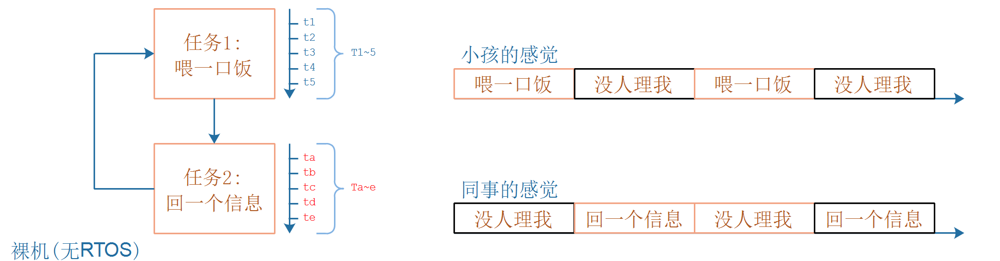
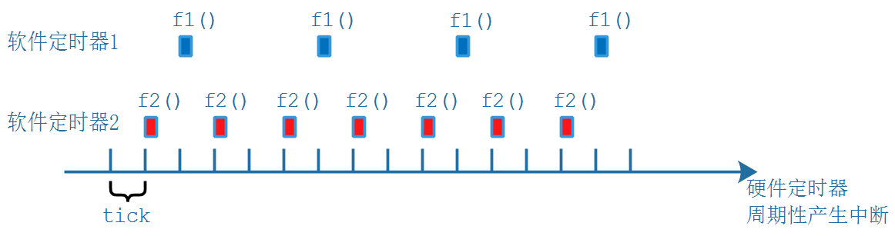

## 裸机程序的不足


### 1. 使用裸机实现的智能家居程序框架


### 2. 裸机程序的不足

#### 2.1 轮询方式的不足

经典的单片机程序时再main函数中循环执行各个子函数，代码如下：

```c
// 经典单片机程序
void main()
{
	while (1)
    {
        喂一口饭();
        回一个信息();
    }
}
```

缺点很明显：各个任务之间互相影响。




#### 2.2 前后台程序的不足

所谓前后台，就是使用中断：

* 前台：中断处理函数
* 后台：main函数


程序框架如下：

```c
void main()
{
	while (1)
    {
        do_something_1();
    }
}

void xxx_isr()
{
    do_something_for_xxx();
}
```

如果中断处理函数`xxx_isr()`执行时间很短，上述代码很适合。

如果`xxx_isr()`执行时间很长，那么早在它执行的过程中：

* 更低优先级的中断无法得到及时处理
* 后台函数`do_something_1()`无法及时执行


可以如下改进，改进后又编程了轮询方式，任务之间互相有影响：

```c
int flag_xxx = 0;
void main()
{
	while (1)
    {
        do_something_1();
        if (flag_xxx)
            do_something_for_xxx();
    }
}

void xxx_isr()
{    
    flag_xxx = 1;
}
```


#### 2.3 软件定时器

这也是前后台框架的一种，实现方式为：

* 实现软件定时器的功能
  * 每个定时器周期性触发
  * 每个定时器都有处理函数
* 硬件定时器启动后，软件定时器被周期性地触发



使用软件定时器可以周期性地执行某些函数，上图实现了2个软件定时器：

* 软件定时器1：每4个tick，执行一次`f1()`
* 软件定时器2：每2个tick，执行一次`f2()`

如果`f1()`、`f2()`执行时间很短，不超过1个tick时，效果很好。一旦`f1()`或`f2()`执行的时间比较长，缺点如下：

* 更低优先级的中断无法得到及时处理
* 后台函数`do_something_1()`无法及时执行


