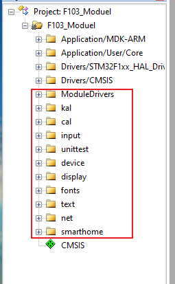
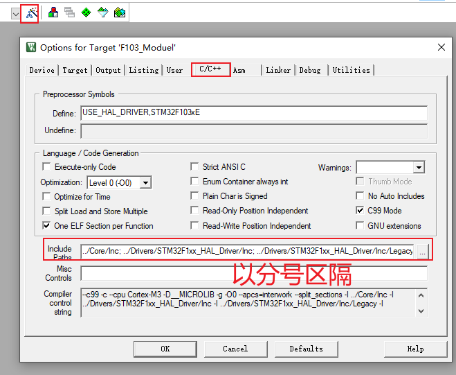

## 程序合并(裸机+FreeRTOS)

本节视频将合并GIT仓库中这两个程序：

* 01_基于HAL库的完整代码

  ```shell
  rtos_doc_source\RTOS培训资料\
  	02_项目2_基于FreeRTOS实现智能家居\
  		03_基于FreeRTOS实现智能家居\
  			1_项目源码\
  				01_基于HAL库的完整代码\10_28_smarthome_ok
  ```

* 02_使用CubeMX创建的FreeRTOS模板

  ```shll
  rtos_doc_source\RTOS培训资料\
  	02_项目2_基于FreeRTOS实现智能家居\
  		03_基于FreeRTOS实现智能家居\
  			1_项目源码\
  				02_使用CubeMX创建的FreeRTOS模板\6_FreeRTOS_Template
  ```

* 合并后得到

  ```shell
  rtos_doc_source\RTOS培训资料\
  	02_项目2_基于FreeRTOS实现智能家居\
  		03_基于FreeRTOS实现智能家居\
  			1_项目源码\
  				03_smarthome_merger_with_freertos
  ```


### 1. 合并代码

`10_28_smarthome_ok` ==> `01_FreeRTOS_Template`

* 复制smartdevice

* 复制ModuleDrivers

* 编译

  * keil工程里添加文件
    

* 指定头文件目录：加入下列目录

  ```shell
  ../smartdevice/cal;../smartdevice/kal;../smartdevice/input;../smartdevice/unittest;../smartdevice/device;../smartdevice/device/display;../smartdevice/config;../smartdevice/fonts;../smartdevice/text;../smartdevice/net;../smartdevice/device/uart;../smartdevice/smarthome
  ```

  

* 再次编译

  ```shell
  F103_Moduel\F103_Moduel.axf: Error: L6200E: Symbol USART3_IRQHandler multiply defined (by driver_usart.o and stm32f1xx_it.o).
  
  F103_Moduel\F103_Moduel.axf: Error: L6200E: Symbol ascii_font multiply defined (by ascii_font_1.o and ascii_font.o).
  ```

* 在工程里删除: ModuleDrivers/ascii_font.c

* 修改Core\Src\stm32f1xx_it.c，去掉`USART3_IRQHandler`