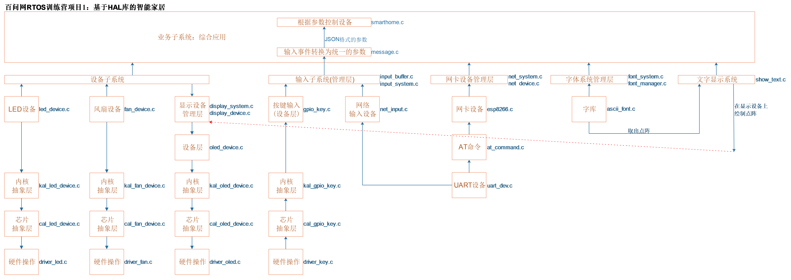

## 使用RTOS改造的思路

### 1. 功能添加

当功能越来越复杂，使用RTOS反而可以降低开发难度、提高开发效率。

我们已经使用裸机实现了下图的功能：

我们还想再增加2个功能：

* 从DHT11读取温湿度、在OLED上显示
* 从互联网获取时间、在OLED上显示

### 2. 程序改造

#### 2.1 任务划分

* 输入
  * 按键输入：使用中断来处理，把输入事件写入"输入队列"
* 网络数据接收与解析任务
  * 微信小程序发来的控制命令
    * 可以继续放在中断里，但是为了便于扩展，使用一个网络接收任务来处理
    * 构造出输入事件，写入"输入队列"
  * 从互联网获取的时间、写入"输入队列"
* 业务
  * 从"输入队列"获取按键输入、微信控制信息，控制设备
  * 从"输入队列"获取温湿度、时间，发给OLED任务
* DHT11任务
  * 读取DHT11温湿度、把结果写入"输入队列"
* OLED任务
  * OLED上要显示的内容很多，有IP地址、温湿度、时间
  * 需要一个统筹管理的OLED任务：它负责操作OLED
  * 其他任务只能向OLED任务发出显示请求
* 时钟任务
  * 从互联网获取时间、把结果写入"输入队列"

