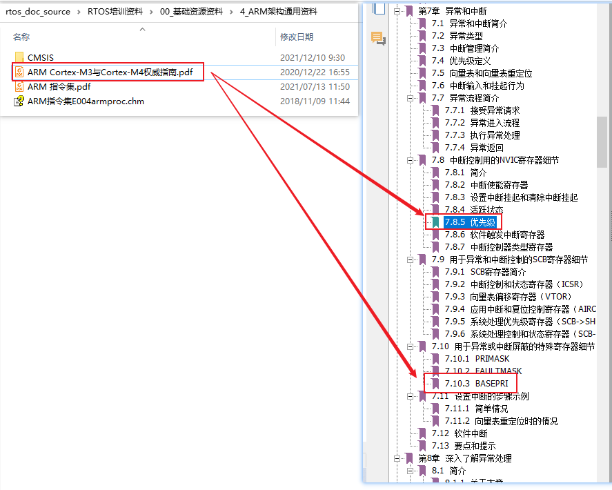

## 调试队列程序

* 本节视频源码

  ```c
  rtos_doc_source\RTOS培训资料\
  	02_项目2_基于FreeRTOS实现智能家居\
  		03_基于FreeRTOS实现智能家居\
  			1_项目源码\
  				04_smarthome_use_freertos_ok               
      			05_smarthome_use_freertos_ok_use_queue_err // 基于此程序修改
      			06_smarthome_use_use_queue_ok              // 本节视频得到这个程序
  ```

* 参考文档：

  

  


### 1. 调试程序

`04_smarthome_use_freertos_ok`程序的数据来源是：

* 按键中断启动定时器，在定时器中断里写环形缓冲区
* UART中断：写环形缓冲区

`04_smarthome_use_freertos_ok`正常运行，表明可以发生中断。


`05_smarthome_use_freertos_ok_use_queue_err`程序的数据来源是：

* 按键中断启动定时器，在定时器中断里写队列
* UART中断：写队列
* 中断正常发生，那就是写队列时出问题


怎么调试？重新定义`configASSERT`：

* `Core\Inc\FreeRTOSConfig.h`

* 修改代码如下：

  ```c
  #define configASSERT( x ) if ((x) == 0) {taskDISABLE_INTERRUPTS(); printf("%s %s %d\r\n", __FILE__, __FUNCTION__, __LINE__); for( ;; );}
  ```

  


### 2. 解决

定时器TIMER8、UART3的中断优先级太高，降低即可。

#### 2.1 修改定时器的优先级

对于定时器TIMER8，如下设置即可：

* 定时器器TIMER8的优先级被多次设置

  * 第1次：

    ```shell
    main
    	HAL_Init
    		HAL_InitTick(TICK_INT_PRIORITY);
    ```

    

  * 第2次：

    ```shell
    main
    	SystemClock_Config
    		HAL_RCC_ClockConfig
    			HAL_InitTick(uwTickPrio);
    ```

  * 解决方法：去掉第2次初始化，如下


#### 2.2 修改网口接收的UART中断优先级

UART3用于网络传输，它的中断优先级要降低：

