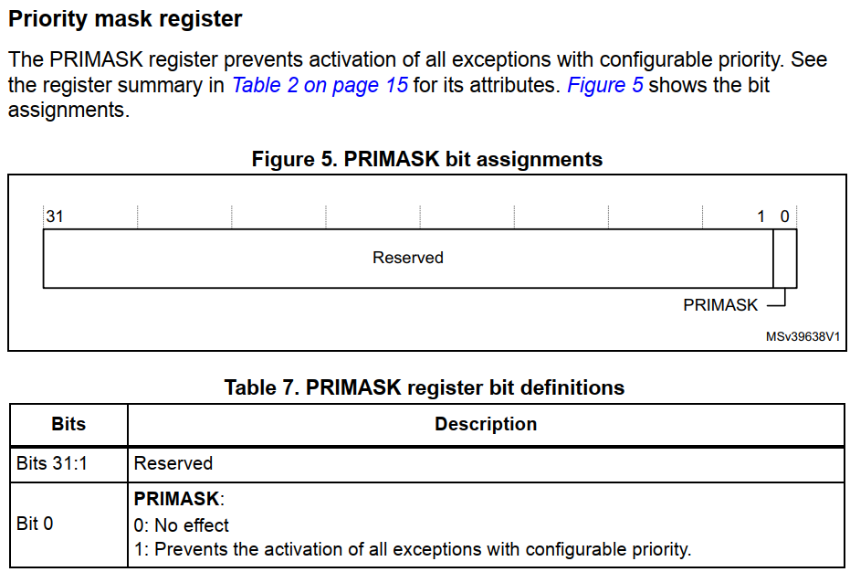

## CortexM3\_M4中断体系彻底讲解

* 本节源码：GIT仓库里

  ```shell
rtos_doc_source\RTOS培训资料\
  	02_项目2_基于FreeRTOS实现智能家居\
  		01_FreeRTOS快速入门\1_项目源码\02_视频配套的源码\27_freertos_example_fromisr // 参考它
  		03_基于FreeRTOS实现智能家居\1_项目源码\07_irq_detail  // 本节代码
  ```
  
  
  
* 参考文档1：GIT仓库里

  

  
  
* 参考文档2：GIT仓库里

  

  


### 1. cortex M的中断体系

参考资料：`STM32F103数据手册.pdf`、`ARM Cortex-M3与Cortex-M4权威指南.pdf`、`PM0056.pdf`

以STM32F103为例，中断的硬件体系如下图：


#### 1.1 NVIC

多个中断源汇聚到NVIC，NVIC的职责就是从多个中断源中取出优先级最高的中断，向CPU发出中断信号。
处理中断时，程序可以写NVIC的寄存器，清除中断。
涉及的寄存器：


我们暂时只需要关注：ISER(中断设置使能寄存器)、ICPR(中断清除挂起寄存器)。
要注意的是，这些寄存器有很多个，比如ISER0、ISER1等等。里面的每一位对应一个中断。
ISER0中的bit0对应异常向量表中的第16项(向量表从第0项开始)，如下图：


#### 1.2 CPU

cortex M3/M4处理器内部有这几个寄存器：

##### 1.2.1 PRIMASK

  

  把PRIMASK的bit0设置为1，就可以屏蔽所有**优先级可配置**的中断。
  可以使用这些指令来设置它：

  ```
  CPSIE I  ; 清除PRIMASK，使能中断
  CPSID I  ; 设置PRIMASK，禁止中断
  
  或者：
  MOV R0, #1
  MSR  PRIMASK R0  ; 将1写入PRIMASK禁止所有中断
  
  MOV R0, #0
  MSR PRIMASK, R0  ; 将0写入PRIMASK使能所有中断
  ```

  

##### 1.2.2 FAULTMASK

  

  FAULTMASK和PRIMASK很像，它更进一步，出来一般的中断外，把HardFault都禁止了。
  只有NMI可以发生。
  可以使用这些指令来设置它：

  ```
  CPSIE F  ; 清除FAULTMASK
  CPSID F  ; 设置FAULTMASK
  
  或者：
  MOV R0, #1
  MSR  FAULTMASK R0  ; 将1写入FAULTMASK禁止中断
  
  MOV R0, #0
  MSR FAULTMASK, R0  ; 将0写入FAULTMASK使能中断
  ```

  

##### 1.2.3 BASEPRI

  

  BASEPRI用来屏蔽这些中断：它们的优先级，其值大于或等于BASEPRI。
  可以使用这些指令来设置它：

  ```
  MOVS R0, #0x60
  MSR BASEPRI, R0   ; 禁止优先级在0x60~0xFF间的中断
  
  MRS R0, BASEPRI   ; 读取BASEPRI
  
  MOVS R0, #0
  MSR BASEPRI, R0    ; 取消BASEPRI屏蔽
  ```


### 2. 三种优先级

假设有A、B 两个中断，提问：

* 能否抢占：A中断处理过程中，B中断能否被马上处理？
* 同时发生的话，谁先被处理？

要解答这个问题，需要引入3种优先级：

* 抢占优先级："高的"可以抢占"低的"，抢占优先级相同的中断不会互相"抢占"
* 子优先级：抢占优先级相同的情况下，同时发生的中断谁先被处理？"子优先级更高的"
* 硬件优先级：如果抢占优先级、子优先级都相同，谁的中断号更小谁就先被处理

#### 2.1 抢占优先级

假设A、B的抢占优先级不同，A的抢占优先级高于B：

* A、B同时发生：A先被处理
* A先发生、B后发生：A先被处理，A被处理完后B才被处理
* B先发生、A后发生：B被处理的过程中，A发生的话A即刻被处理，A抢占了B

#### 2.2 子优先级

假设A、B的抢占优先级相同，那么由子优先级决定。假设A的子优先级高于B：

* A、B同时发生：A先被处理，A处理完再处理B
* A先发生、B后发生：A先被处理，A处理完再处理B
* B先发生、A后发生：B先被处理，B处理完再处理A

#### 2.3 硬件优先级

在软件的中断向量表中可以看到有很多外部中断：

* 在向量表中的顺序，就对应这些中断的硬件编号
* 如果抢占优先级、子优先级都相同，这些中断同时发生时，靠前面的中断先被处理


### 3. 怎么表示中断优先级

在上面的向量表中，前面有16项，后面的"External Interrupts"最多有240项，加起来最多有256项。


硬件优先级在设计芯片时就定下来了，无法修改。

每个中断都有一个8位的优先级寄存器，里面含有它的抢占优先级、子优先级：

* 这8位数据，都用完吗？不同的芯片，使用的位数不一样，假设用到了N位，即bit7, bit6, ...
* 这N位里，哪几位表示抢占优先级？哪几位表示子优先级？


#### 3.1 中断优先级寄存器

每个中断都有一个8位的寄存器：

* 地址范围：从0xE000E400-0xE000E4EF，共240个寄存器，对应240个中断

* 下表中的NVIC结构体如下

  ```c
  typedef struct
  {
    __IOM uint32_t ISER[8U];               /*!< Offset: 0x000 (R/W)  Interrupt Set Enable Register */
          uint32_t RESERVED0[24U];
    __IOM uint32_t ICER[8U];               /*!< Offset: 0x080 (R/W)  Interrupt Clear Enable Register */
          uint32_t RSERVED1[24U];
    __IOM uint32_t ISPR[8U];               /*!< Offset: 0x100 (R/W)  Interrupt Set Pending Register */
          uint32_t RESERVED2[24U];
    __IOM uint32_t ICPR[8U];               /*!< Offset: 0x180 (R/W)  Interrupt Clear Pending Register */
          uint32_t RESERVED3[24U];
    __IOM uint32_t IABR[8U];               /*!< Offset: 0x200 (R/W)  Interrupt Active bit Register */
          uint32_t RESERVED4[56U];
    __IOM uint8_t  IP[240U];               /*!< Offset: 0x300 (R/W)  Interrupt Priority Register (8Bit wide) */
          uint32_t RESERVED5[644U];
    __OM  uint32_t STIR;                   /*!< Offset: 0xE00 ( /W)  Software Trigger Interrupt Register */
  }  NVIC_Type;
  ```


虽然每个中断的优先级寄存器有8位，但是设计芯片时并不一定全部实现这8位：


怎么知道芯片实现了几位？可以往任意一个优先级寄存器写入0xFF再读出来，未实现的位(未使用的位)就是0。假设只实现了bit7、bit6、bit5，那么写入0xFF后读出的值就是0xE0，二进制就是0b11100000。


#### 3.2 优先级寄存器中位的划分

每个中断都有一个8位优先级寄存器，这8位中哪些位表示"抢占优先级"、哪些位表示"子优先级"？

这由"应用中断和复位控制寄存器"(Application Interrupt and Reset Control Register,   AIRCR)决定。

**注意**：这个寄存器决定所有中断的优先级寄存器里各位如何划分。

AIRCR寄存器说明：

* 地址：0xE000ED0C

* 位图
  


我们关注的是b[10:8]，它决定了所有中断优先级寄存器的位划分：

| b[10:8]取值 | 优先级寄存器的位                            |
| ----------- | ------------------------------------------- |
| 0           | 7.1：高7位表示抢占优先级，低1位表示子优先级 |
| 1           | 6.2：高6位表示抢占优先级，低2位表示子优先级 |
| 2           | 5.3：高5位表示抢占优先级，低3位表示子优先级 |
| 3           | 4.4：高4位表示抢占优先级，低4位表示子优先级 |
| 4           | 3.5：高3位表示抢占优先级，低5位表示子优先级 |
| 5           | 2.6：高2位表示抢占优先级，低6位表示子优先级 |
| 6           | 1.7：高1位表示抢占优先级，低7位表示子优先级 |
| 7           | 0.8：全部8位都用来表示子优先级              |


### 4. 程序演示


