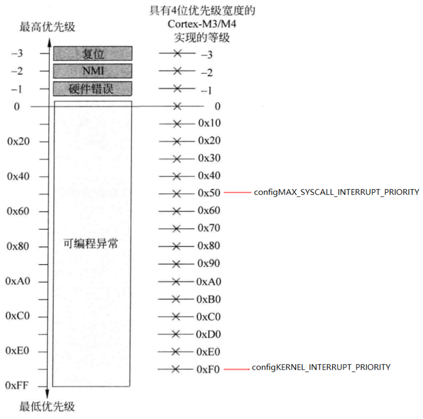
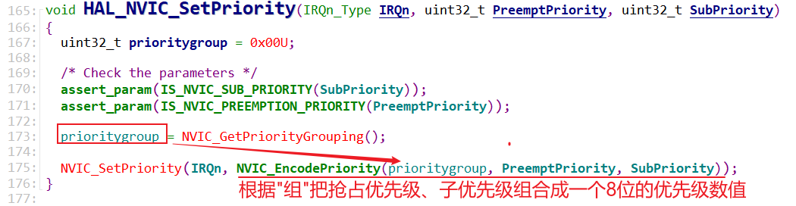
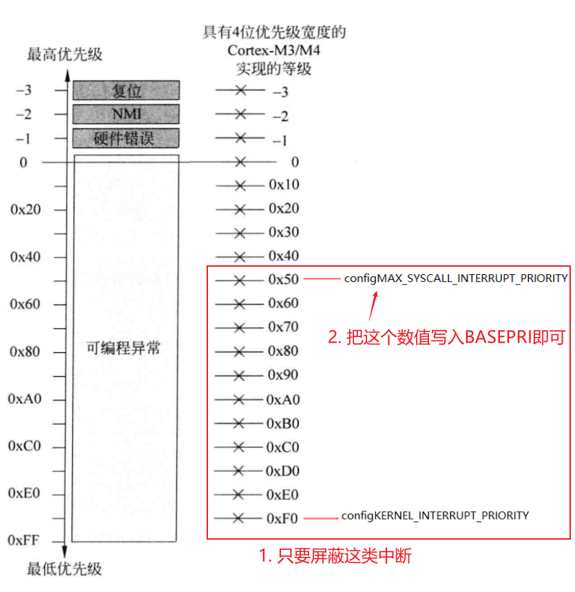

## FreeRTOS的中断设置

* 本节源码：GIT仓库里

  ```shell
  rtos_doc_source\RTOS培训资料\
  	02_项目2_基于FreeRTOS实现智能家居\
  		03_基于FreeRTOS实现智能家居\1_项目源码\06_smarthome_use_use_queue_ok
  ```
  


### 1. 中断相关的几个宏

* __NVIC_PRIO_BITS

  * 位置：`Drivers\CMSIS\Device\ST\STM32F1xx\Include\stm32f103xe.h`

    ```c
    #define __NVIC_PRIO_BITS           4U       /*!< STM32 uses 4 Bits for the Priority Levels    */
    ```

  * 作用：优先级寄存器中实现了多少位

* configPRIO_BITS

  * 位置：`Core\Inc\FreeRTOSConfig.h`

    ```
     #define configPRIO_BITS         __NVIC_PRIO_BITS 
    ```

  * 作用：优先级寄存器中实现了多少位

* configLIBRARY_LOWEST_INTERRUPT_PRIORITY

  * 位置：`Core\Inc\FreeRTOSConfig.h`

    ```c
    #define configLIBRARY_LOWEST_INTERRUPT_PRIORITY   15
    ```

  * 作用：设置中断优先级时，能传入的最低优先级的数值(优先级越低数值越高)

  * 这个数值要移位后才能写入寄存器，移位后的宏是`configKERNEL_INTERRUPT_PRIORITY`

* configLIBRARY_MAX_SYSCALL_INTERRUPT_PRIORITY

  * 位置：`Core\Inc\FreeRTOSConfig.h`

    ```c
    #define configLIBRARY_MAX_SYSCALL_INTERRUPT_PRIORITY 5
    ```

  * 作用：能使用各类FromISR函数的中断的最高优先级(优先级越高数值越小)

  * 这个数值要移位后才能写入寄存器，移位后的宏是`configMAX_SYSCALL_INTERRUPT_PRIORITY`

* configKERNEL_INTERRUPT_PRIORITY

  * 位置：`Core\Inc\FreeRTOSConfig.h`

    ```c
    #define configKERNEL_INTERRUPT_PRIORITY 		( configLIBRARY_LOWEST_INTERRUPT_PRIORITY << (8 - configPRIO_BITS) )
    ```

  * 作用：FreeRTOS内核本身运行时的最低优先级，就是`configLIBRARY_LOWEST_INTERRUPT_PRIORITY`移位后写入寄存器的值

* configMAX_SYSCALL_INTERRUPT_PRIORITY

  * 位置：`Core\Inc\FreeRTOSConfig.h`

    ```c
    #define configMAX_SYSCALL_INTERRUPT_PRIORITY 	( configLIBRARY_MAX_SYSCALL_INTERRUPT_PRIORITY << (8 - configPRIO_BITS) )
    ```

  * 作用：能使用各类FromISR函数的中断的最高优先级(优先级越高数值越小)

  * 来自`configLIBRARY_MAX_SYSCALL_INTERRUPT_PRIORITY`，移位后写入寄存器


#### 1.2 FreeRTOS中断优先级划分




### 2. 中断相关的几个函数

#### 2.1 设置中断分组

```c
main
    HAL_Init
    	HAL_NVIC_SetPriorityGrouping(NVIC_PRIORITYGROUP_4); /* bit[7:4]用于抢占优先级, bit[3:0]用于子优先级*/
```


由于STM32F103只实现了优先级寄存器中的4位，而上述函数把高4位用作抢占优先级，所以：

* FreeRTOS中只有抢占优先级, 没有子优先级
* FreeRTOS中有16级中断


#### 2.2 设置Tick中断优先级

Tick中断的优先级最低：

```c
#define  TICK_INT_PRIORITY            15U    /*!< tick interrupt priority (lowest by default)  */
```


函数调用过程如下：

```c
main
    HAL_Init
    	HAL_InitTick(TICK_INT_PRIORITY);
			HAL_NVIC_SetPriority(TIM8_UP_IRQn, TickPriority ,0); /* 抢占优先级=TICK_INT_PRIORITY,子优先级=0 */
```




#### 2.3 设置PendSV中断优先级

```c
main
    HAL_Init
    	HAL_MspInit
    		HAL_NVIC_SetPriority(PendSV_IRQn, 15, 0);
```

PendSV的中断优先级也设置位16，最低。


#### 2.4 中断优先级判断

在中断处理函数里调用FromISR后缀的函数时，会判断：

* 当前中断的优先级数值是否大于或等于`configMAX_SYSCALL_INTERRUPT_PRIORITY`(数值上小于)
  * 条件成立：可以使用FromISR后缀的函数
  * 条件不成立：现在发生的是更高优先级的中断，这些中断不允许使用FreeRTOS的API函数

调用示例：

```c
xQueueGiveFromISR
    portASSERT_IF_INTERRUPT_PRIORITY_INVALID();
		vPortValidateInterruptPriority
            
            // 读取寄存器确定当前中断的优先级
            ucCurrentPriority = pcInterruptPriorityRegisters[ ulCurrentInterrupt ];

			// 确定当前中断的优先级，在数值上 >= ucMaxSysCallPriority
			configASSERT( ucCurrentPriority >= ucMaxSysCallPriority );
```


#### 2.5 关中断

在FreeRTOS中实现队列等机制时，需要关中断。

关中断时，并不需要关闭整个系统的中断：

* 更高优先级的中断不允许使用FreeRTOS的API函数，它们不会访问队列等对象，所以这些中断无需屏蔽
* 只需要屏蔽一类中断：
  

代码如下：

```c
static portFORCE_INLINE void vPortRaiseBASEPRI( void )
{
uint32_t ulNewBASEPRI = configMAX_SYSCALL_INTERRUPT_PRIORITY;

	__asm
	{
		/* Set BASEPRI to the max syscall priority to effect a critical
		section. */
		msr basepri, ulNewBASEPRI
		dsb
		isb
	}
}
```


