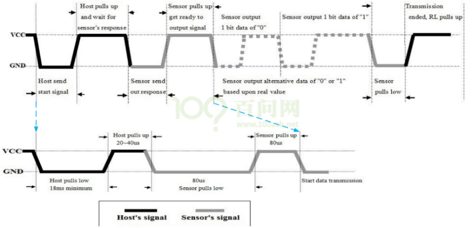

# DHT11温湿度传感器的使用


## 1. DHT11工作原理

### 1.1 硬件信号


需要先发一个开始信号给DHT11，才能接收数据。

下图为一次完整的传输示例，其中深黑色信号表示由主机驱动，即主机向DHT11发信号，浅灰色信号表示DHT11驱动，即DHT11发向主机发信号。



当主机没有与DHT11通信时，总线处于空闲状态，此时总线电平由于上拉电阻的作用处于高电平。

当主机与DHT11正在通信时，总线处于通信状态，一次完整的通信过程如下：

* 主机将对应的GPIO管脚配置为输出，准备向DHT11发送数据；
*  主机发送一个开始信号：
  * 开始信号 = 一个低脉冲 + 一个高脉冲。低脉冲至少持续18ms，高脉冲持续20-40us。

* 主机将对应的GPIO管脚配置为输入，准备接受DHT11传来的数据，这时信号由上拉电阻拉高；
* DHT11发出响应信号：
  * 响应信号 = 一个低脉冲 + 一个高脉冲。低脉冲持续80us，高脉冲持续80us。

* DHT11发出数据信号：
  * 数据为0的一位信号 = 一个低脉冲 + 一个高脉冲。低脉冲持续50us，高脉冲持续26～28us。
  * 数据为1的一位信号 = 一个低脉冲 + 一个高脉冲。低脉冲持续50us，高脉冲持续70us。

* DHT11发出结束信号：
  * 最后1bit数据传送完毕后，DHT11拉低总线50us，然后释放总线，总线由上拉电阻拉高进入空闲状态。

​                               

###  1.2 数据格式

数据格式: 

```shell
8bit湿度整数数据+8bit湿度小数数据
+8bi温度整数数据+8bit温度小数数据
+8bit校验和
```

数据传送正确时,校验和等于“8bit湿度整数数据+8bit湿度小数数据+8bi温度整数数据+8bit温度小数数据”所得结果的末8位。

 

## 2. 编程思路

有了上述基础知识后就可以开始编写程序了。

编程思路如下：

* 设置好GPIO；
* 主机把GPIO设置为输出引脚，发送开始信号，然后把GPIO设置为输入引脚；
* 主机判断是否收到DHT11的回应信号；
* 接收到回应信号后，开始读取数据；
* 接收完数据后，校验、解析。


关键在于如何得到一位数据，看看下图：

* 先等待低电平结束，一直等到出现高电平；然后延时40us，读取GPIO值：这就是该位的数据值。

 


