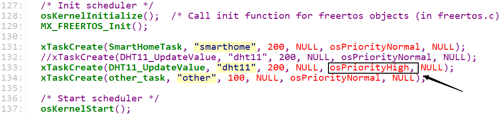

# 在多任务系统中使用DHT11

* 本节源码：GIT仓库里

  ```shell
  rtos_doc_source\RTOS培训资料\
  	02_项目2_基于FreeRTOS实现智能家居\
  		03_基于FreeRTOS实现智能家居\1_项目源码\09_smarthome_dht11_priority
  ```
  


## 1. 多任务系统中怎么使用DHT11

### 1.1 读一次数据消耗的时间

硬件连接如下图：


时序：


### 1.2 FreeRTOS任务调度

在配置文件`FreeRTOSConfig.h`中：

```c
#define configTICK_RATE_HZ                       ((TickType_t)1000)
```

这表示FreeRTOS中有多个同优先级的就绪任务时，它们依次执行1ms。

而读取DHT11时最少耗时3.32ms，如果读取DHT11的过程被其他任务打断的话，必定失败。


### 1.3 解决方法

三种方法：

* 读取时关中断或者关闭调度

* 把DHT11的任务优先级设置为最高

* 修改程序，在中断里记录时间、解析数据


#### 1.3.1 关闭调度器

`smarthome`任务在连接WIFI、获取IP的过程中，不要被其他任务打断：


`DHT11`任务在读取DHT11的过程中，不要被其他任务打断：


#### 1.3.2 设置DHT11任务优先级




