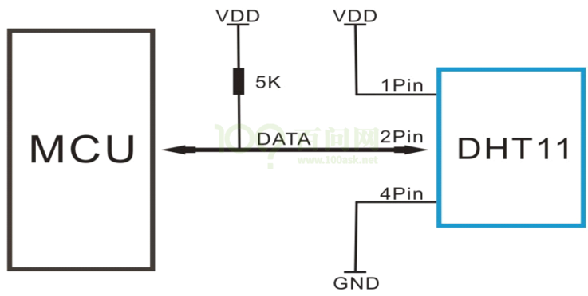
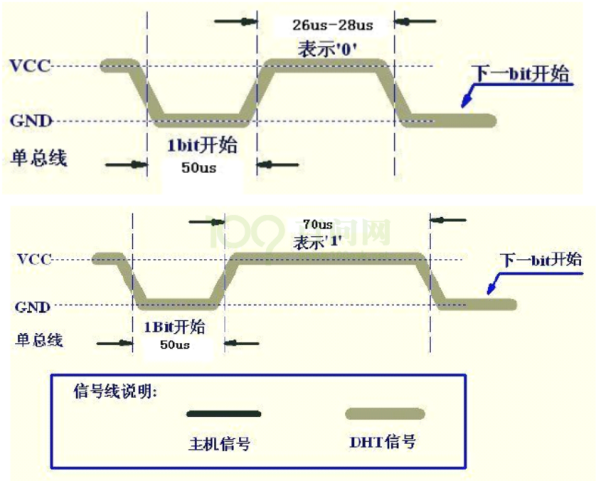

# 使用中断来实现DHT11的读取

* 本节源码：GIT仓库里

  ```shell
  rtos_doc_source\RTOS培训资料\
  	02_项目2_基于FreeRTOS实现智能家居\
  		03_基于FreeRTOS实现智能家居\1_项目源码\10_smarthome_dht11_isr // 未测试
  ```
  


## 1. 通信协议

硬件连接如下图：




时序：





## 2. 编程思路

* 初始化
  * 设置定时器，精度要达到1us量级
  * 设置DHT11数据引脚：用于中断、双边沿触发
* 在`DHT11_Read`函数中：
  * 发出Start信号
  * 等待ACK
  * 使能数据引脚的中断
  * 阻塞
* 在DHT11数据引脚的中断函数中
  * 记录中断发生的时间，放在数组里
  * 累加中断次数，发现40位数据都接收完毕后，唤醒任务
* 任务被唤醒后：根据中断时间解析出得到的数据


## 3. 编程

### 3.1 设置DHT11 GPIO中断


### 3.2 在中断中记录时间


