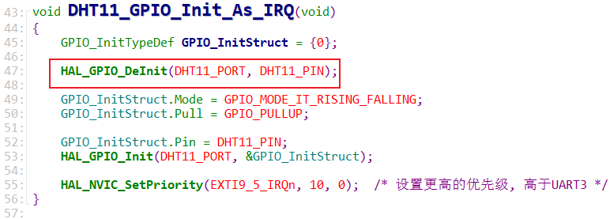
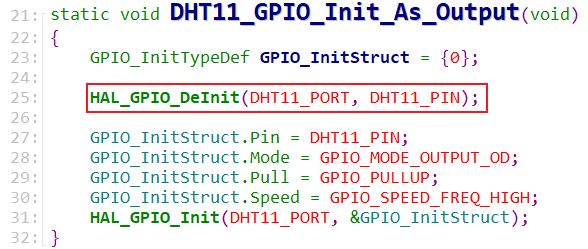
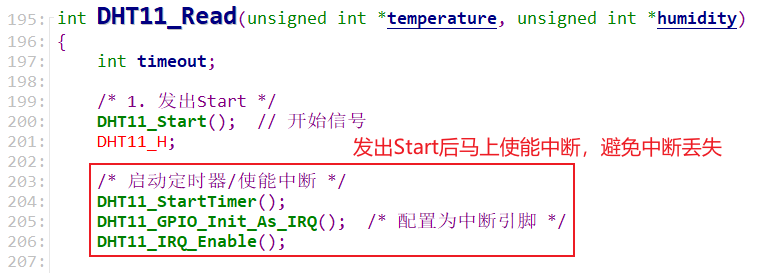
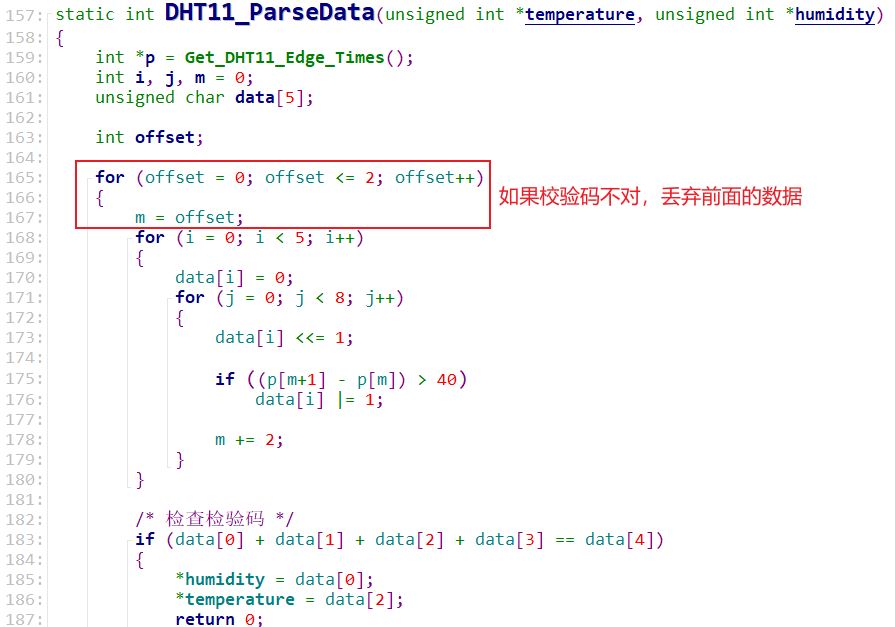

# 使用中断来实现DHT11的读取_调试

* 本节源码：GIT仓库里

  ```shell
  rtos_doc_source\RTOS培训资料\
  	02_项目2_基于FreeRTOS实现智能家居\
  		03_基于FreeRTOS实现智能家居\1_项目源码\11_smarthome_dht11_isr_ok
  ```
  


## 1. 上机调试

看视频，或者对比源码：

```shell
10_smarthome_dht11_isr
11_smarthome_dht11_isr_ok
```


### 1.1 解决编译错误


### 1.2 上机测试


## 2. 程序要点

### 2.1 GPIO初始化

要先执行`HAL_GPIO_DeInit`，比如设置引脚为中断功能：



再比如设置引脚为输出功能：




### 2.2 中断丢失

DHT11的中断发生间隔很短，比如最短间隔有26~28us，很容易丢失中断。

我们发出Start信号后，再去使能中断：使能过程中也可能丢失中断。

解决方法如下：

* 发出Start信号后，就马上使能中断，避免数据位的中断丢失
  

* 发出Start信号后马上就使能中断的话，有可能记录到ACK的中断信息

  * 解析数据时要根据校验码丢弃掉前面的ACK数据
  * 函数`DHT11_ParseData`中，发现校验码不对时，就会丢弃前面的数据，重新计算后面的数据校验码
    

* 在我们的系统里UART3用于网络模块ESP8266，UART3会时不时接收到数据，所以：

  * DHT11 GPIO的中断优先级要高于UART3，代码对比如下：

    ```c
    DHT11_GPIO_Init_As_IRQ
    	HAL_NVIC_SetPriority(EXTI9_5_IRQn, 10, 0);  /* 设置更高的优先级, 高于UART3 */
    
    main
        EnableUART3IRQ
        	HAL_NVIC_SetPriority(USART3_IRQn, 14, 1);
    ```

    

    

