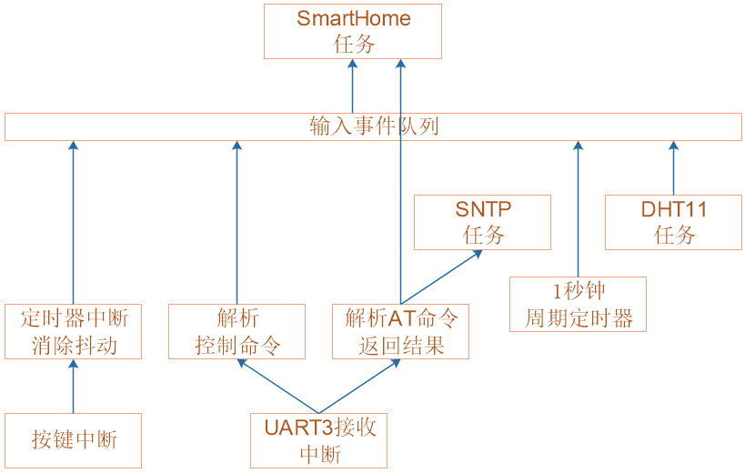

# 智能家居项目增加功能_框架设计

## 1. 程序框架

输入事件队列是信息中轴：

* 按键中断触发定时器中断，消除抖动后往队列写入"按键类事件"
* 我们使用微信小程序、sscom发出控制命令，UART3接收到数据，解析出数据后往队列写入"网络类事件"
* SNTP任务：每隔几小时通过网络获取时间，修正本地时间
* 1秒钟周期定时器：往队列写入"时间类事件"，以便更新OLED上的时间
* DHT11任务：每隔几秒钟读取温湿度，往队列写入"温湿度类事件"
* SmartHome任务：
  * 连接WIFI
  * 读取输入事件，控制设备：LED、风扇、OLED

## 2. 任务优先级

* SmartHome任务：优先级最高，它要及时响应用户的操作，平时大部分时间都是阻塞状态
* 定时器后台任务：优先级第2高，用来更新时间，如果时间的更新不及时会影响产品体验
* SNTP任务：优先级第3高，它每隔几小时执行一次，用来修正时间
* DHT11任务：优先级最低，温湿度不会剧烈变化

